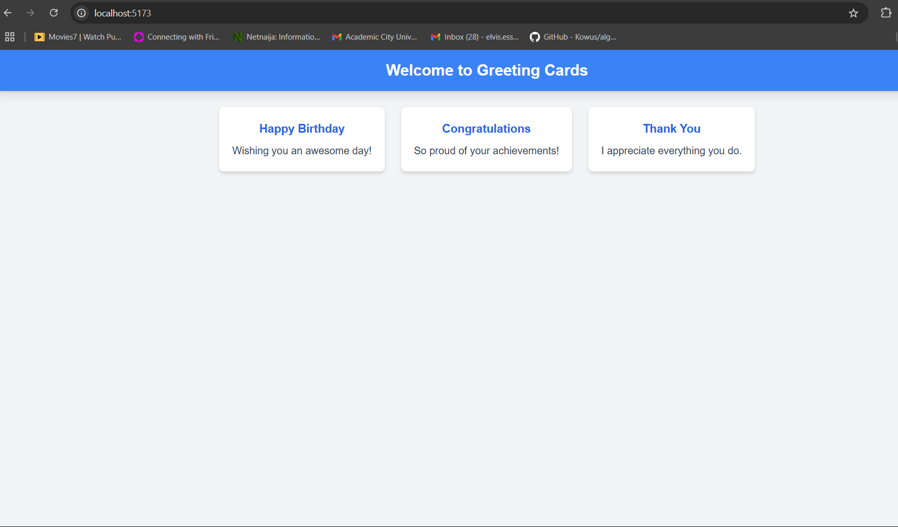

# React + Vite
# Greeting Cards App

## Project Overview
This project is a simple Greeting Cards application built using **React** and **Tailwind CSS**. The goal of the project was to practice React components, Tailwind CSS styling, and dynamic rendering of props.

### What I Learned
- Building reusable React components.
- Applying styling with Tailwind CSS.
- Structuring a React project with multiple components.


---

## Technologies Used
- **React**: For building UI components.
- **Tailwind CSS**: For styling.
- **Vite**: For fast development and bundling.

---

## Testing Screenshots
Below are screenshots of the application's final output:

### Full Webpage
This shows the `Header` and the three greeting cards rendered correctly:


---

## Discussion
Working on this project helped me improve my understanding of React and Tailwind CSS. The biggest challenge was setting up Tailwind CSS with React, but once it was configured correctly, styling became much easier.

---

## How to Run This Project
1. Clone the repository:
   ```bash
   git clone <repository-link>
